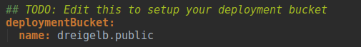
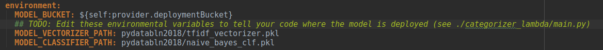
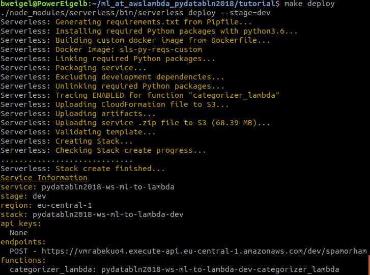

## Try out the demo project

### Steps (using the provided docker image)

**1.-4.** of [Quickstart](https://github.com/bweigel/ml_at_awslambda_pydatabln2018#quickstart), then...

Inside the container:
```
$ cd /demo
$ make deploy-model
    # ... enter your S3-info when prompted
$ vi serverless.yml
    # ... see & edit TODOs in serverless.yml
$ make setup && make deploy
    # ... serverless is deploying ...
$ curl -X POST https://<see serverless output>.execute-api.eu-central-1.amazonaws.com/dev/spamorham -d "Am I spam or ham?"
```
### Steps (using your machine)
 
**1.-3.** of [Quickstart](https://github.com/bweigel/ml_at_awslambda_pydatabln2018#quickstart), then...

4. setup tooling with `make setup`. This installs:
    - virtualenv with dependencies defined in `Pipfile` using `pipenv` in `.venv`
    - the serverless framework and dependencies defined in `package.json` via `npm install` in `node_modules`    
5. create an s3 bucket to hold models and lambda code: `make bucket`
    - **BEWARE** S3-bucket names must be globally unique!
6. upload the provided models in `training/models` using `make deploy-model`
    - this will prompt you to enter the bucket name from **5** and an object prefix (think of it as a folder name)
    - the output tells you what has been uploaded:
        ```bash
        $ make deploy-model
        ./training/deploy_model.sh
        Enter bucket name: eigelbdemo
        Enter object prefix: pydatabln2018
        + aws s3 cp --recursive ./training/models s3://eigelbdemo/pydatabln2018/
        upload: training/models/naive_bayes_clf.pkl to s3://eigelbdemo/pydatabln2018/naive_bayes_clf.pkl
        upload: training/models/tfidf_vectorizer.pkl to s3://eigelbdemo/pydatabln2018/tfidf_vectorizer.pkl
        ```
5. find the `TODOs` in the `serverless.yml` and fill in the bucket specified in **5** and the path to the classifiers:
    
    
6. deploy your service to AWS using `make deploy`
    
7. test your service (take url from `make deploy` output):
     ```
     $ curl -X POST https://vmrabekuo4.execute-api.eu-central-1.amazonaws.com/dev/spamorham -w "\n" -d "Am I spam or am I ham?" 
    ["spam"]
    ```
